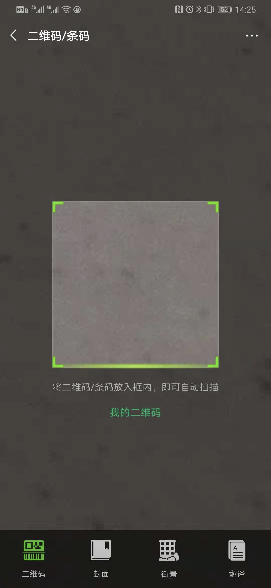
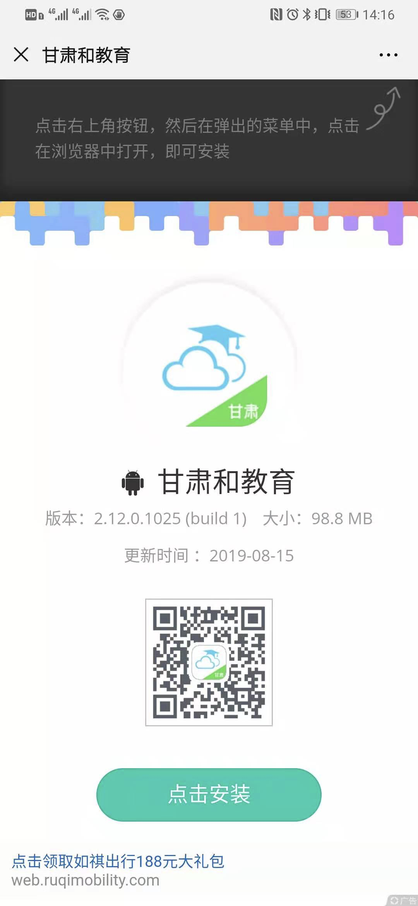
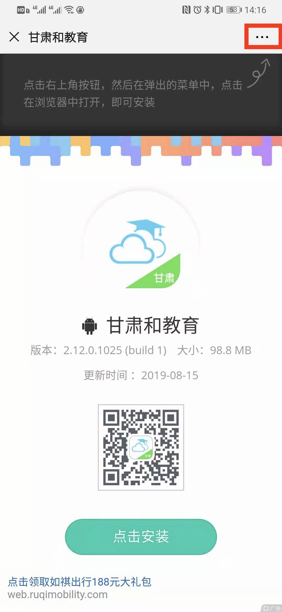
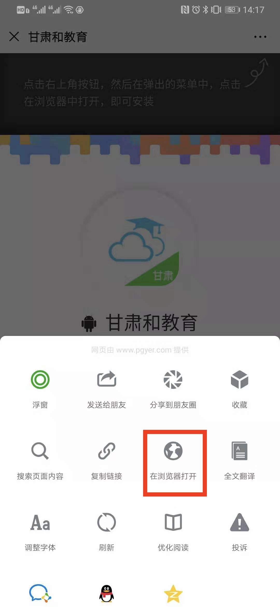
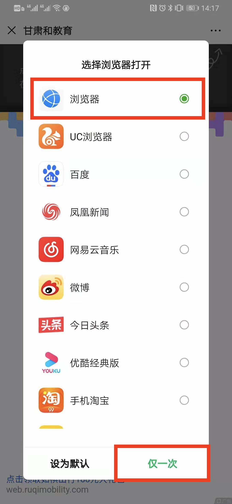
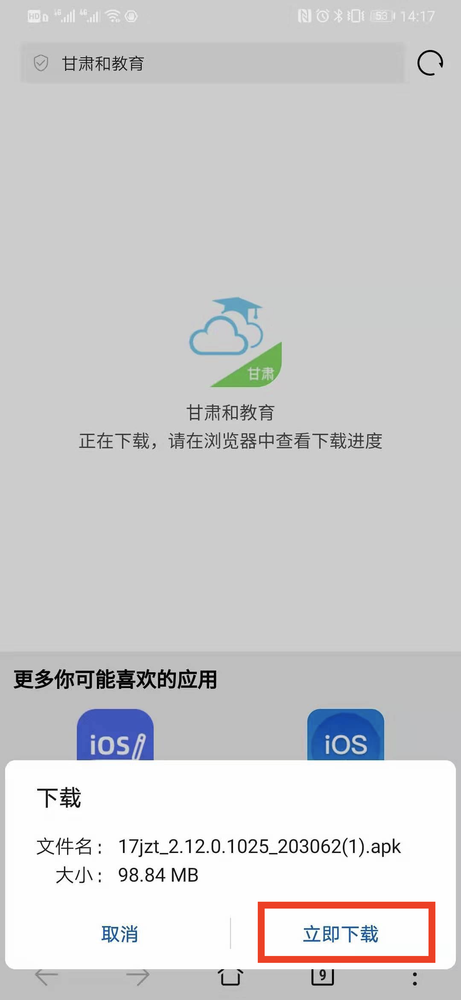
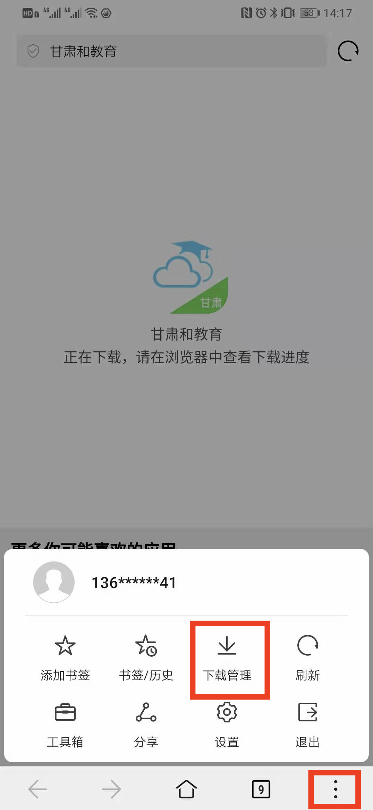
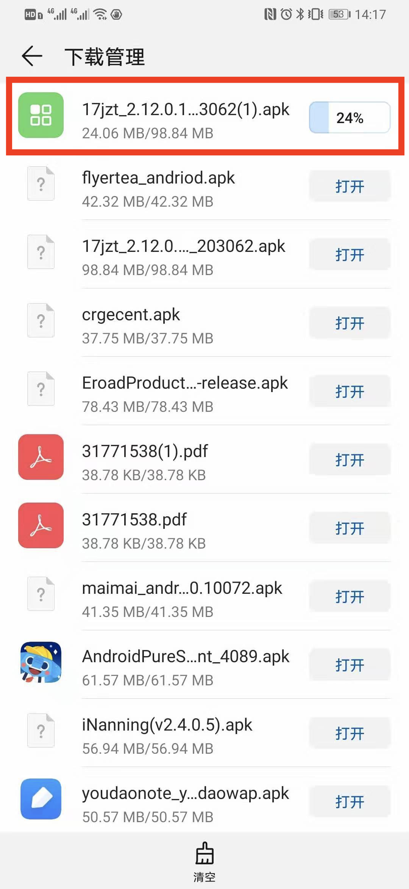
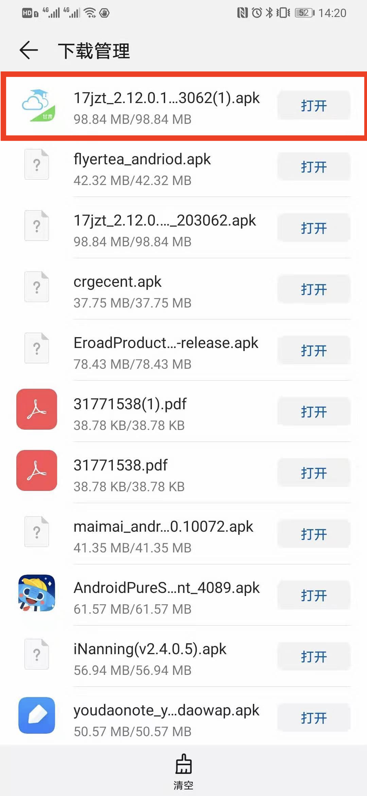

## 1.应用下载
### 1.1 甘肃和教育APP下载二维码
`甘肃和教育APP下载二维码` |
-|
|

### 1.2 扫描二维码
`1.打开扫一扫` |`2.扫描二维码` 
-|-|
 |  |
### 1.3 在浏览器中打开

`1.点击右上角**...**` |`2.点击在浏览器中打开`  |`3.选择浏览器`
-|-|-|
||

### 1.4 点击安装
`1.点击“点击安装”`|`2.点击“立即下载”`
-|-|
|
### 1.5 下载进度
`1.点击浏览器**...**，点击下载管理` |`2.找到对应下载内容`  |`3.下载完成`
-|-|-|
||
