## 5.绑定孩子
### 5.1 已有一起小学账号绑定
 `1.点击绑定孩子` |`2.选择有`  |`3.输入手机号码、密码点击确定`
-|-|-|
||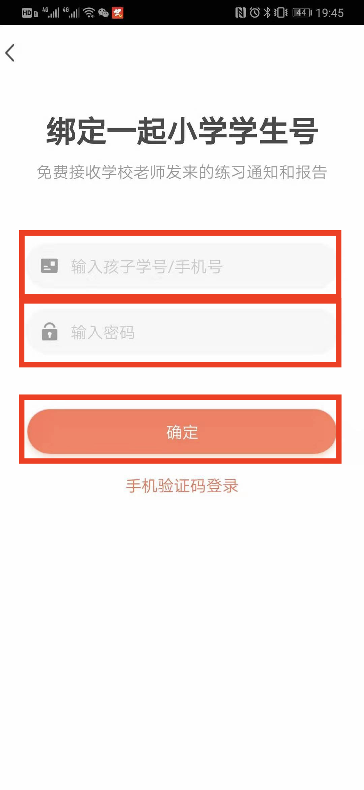
 `4.忘记密码点击手机验证码登录` |`5.输入手机孩子绑定的手机号码`  |`6.点击获取验证码`
 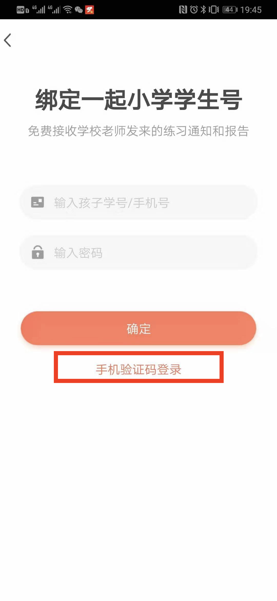|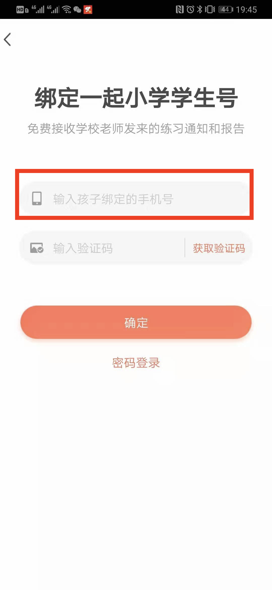|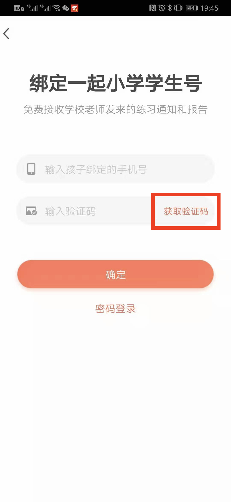
 `7.输入验证码` |`8.点击确认`  |
 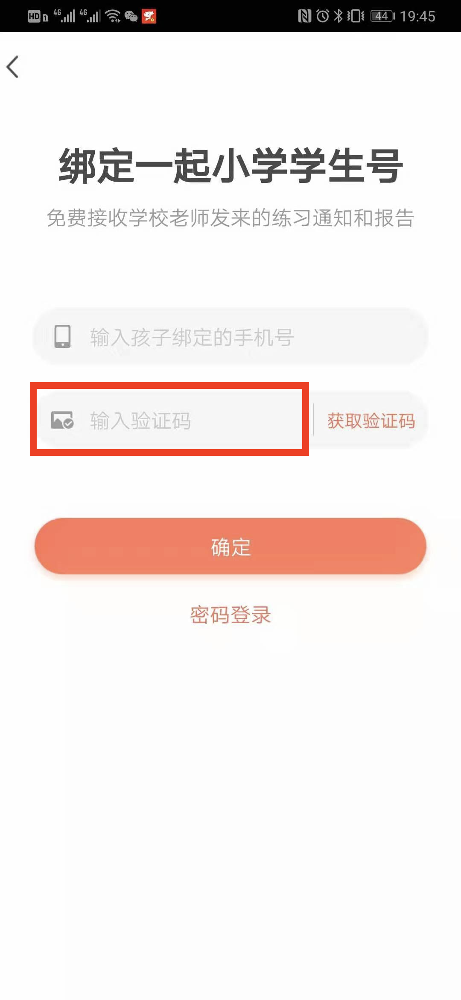|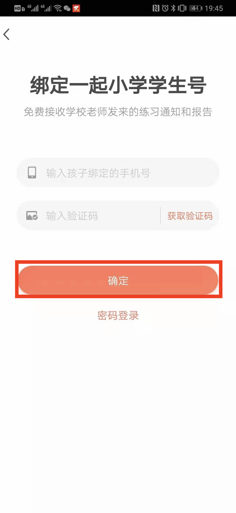|
### 5.2 没有一起小学账号绑定
 `1.点击绑定孩子` |`2.选择没有`  |`3.输入孩子姓名`
-|-|-|
|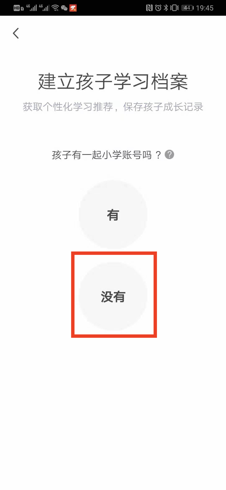|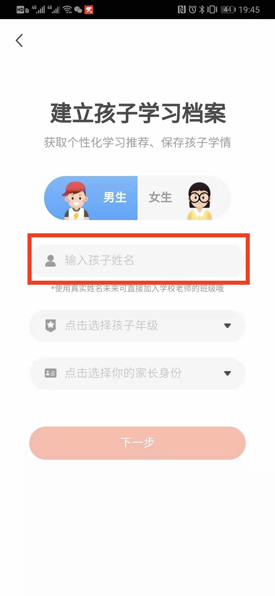
 `4.选择孩子年级` |`5.选择家长身份`  |`6.点击下一步`
 ||
 `7.输入手机号码` |`8.点击获取验证码`  |`9.输入验证码` 
 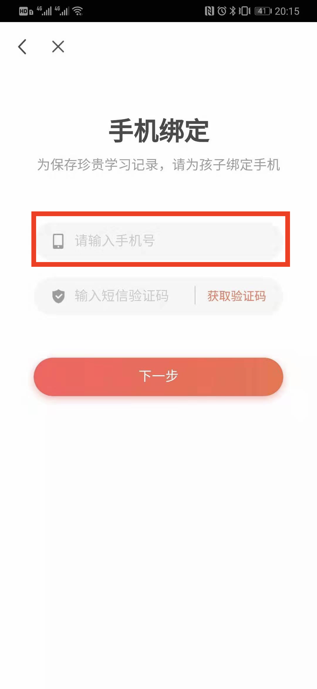|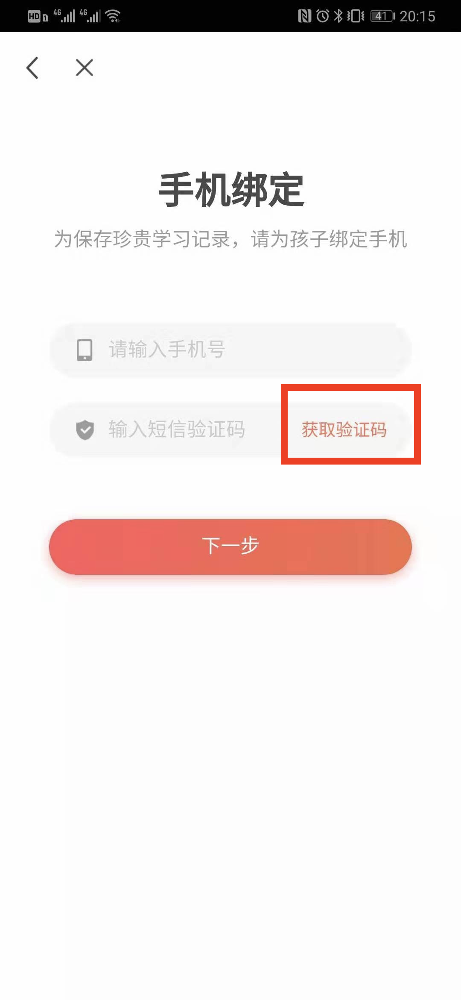|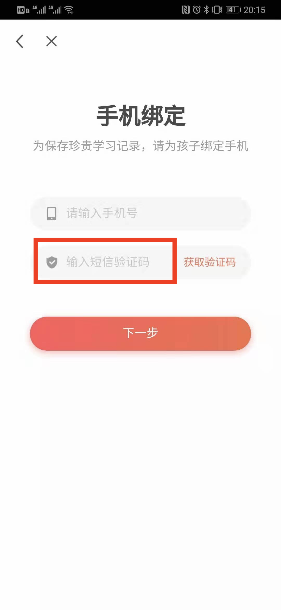
 `10.点击下一步` | |
 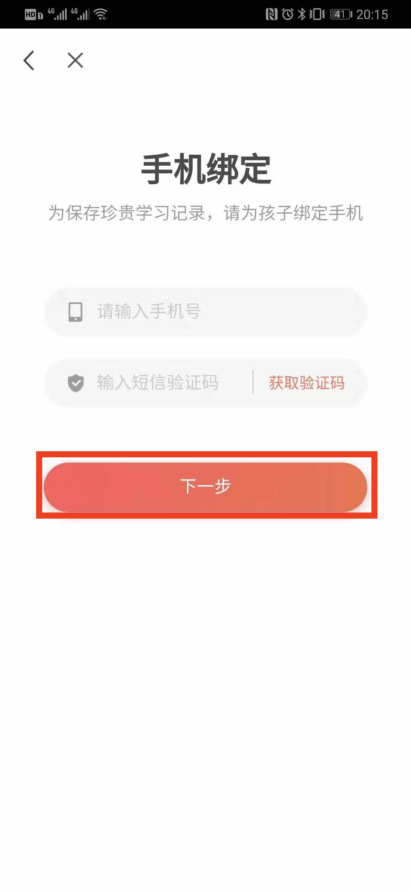||

### 5.3 家长和孩子手机号码一致
 `1.点击绑定孩子` |`2.手机号已绑定孩子`  |`3.点击直接添加`
-|-|-|
||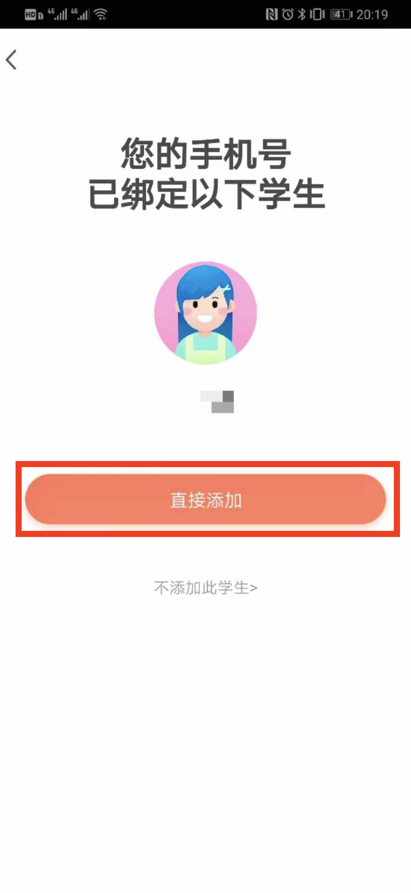
`4.选择家长身份` |`5.点击完成`  |`6.绑定成功`
 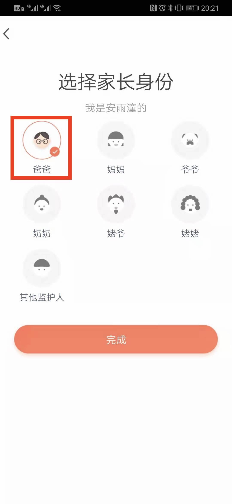|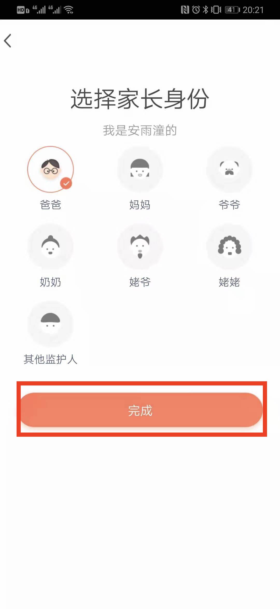|