## 6.套餐购买
`1.点击立即选购` |`2<1>.点击乐学套餐`  |`2<2>.点击趣学套餐`
-|-|-|
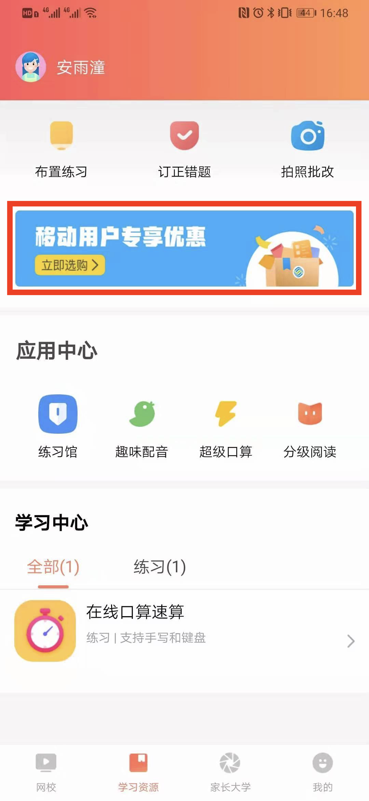|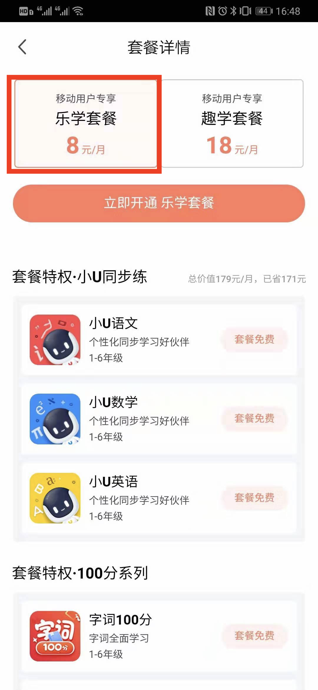|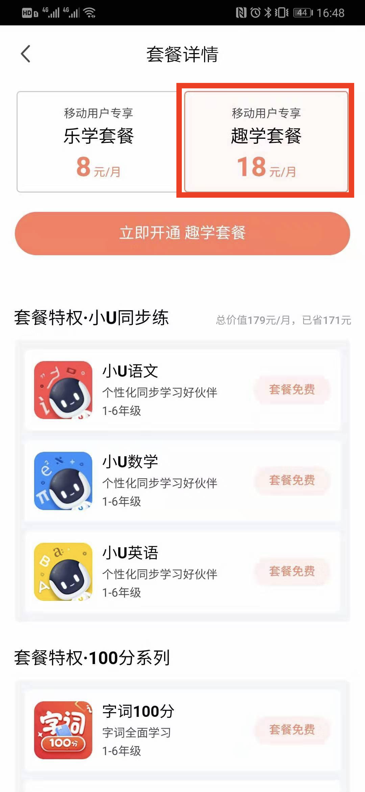
 `3.点击立即开通[乐学/趣学套餐]` |`4.点击获取验证码`  |`5.输入验证码`
 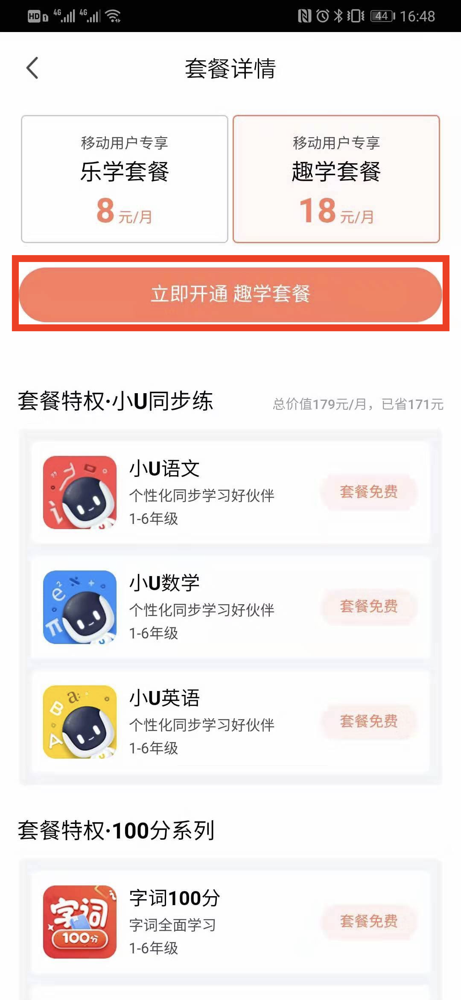|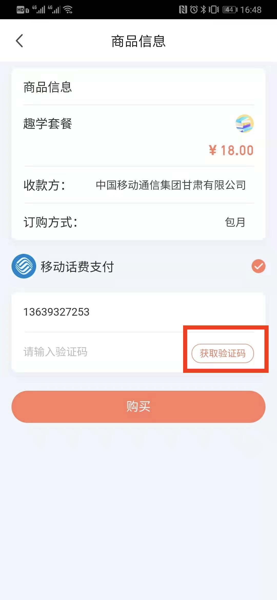|
  `6.点击购买` |`7.弹出确认框`  |`8.切换到短信`
 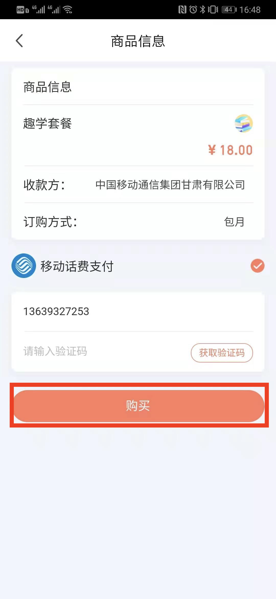|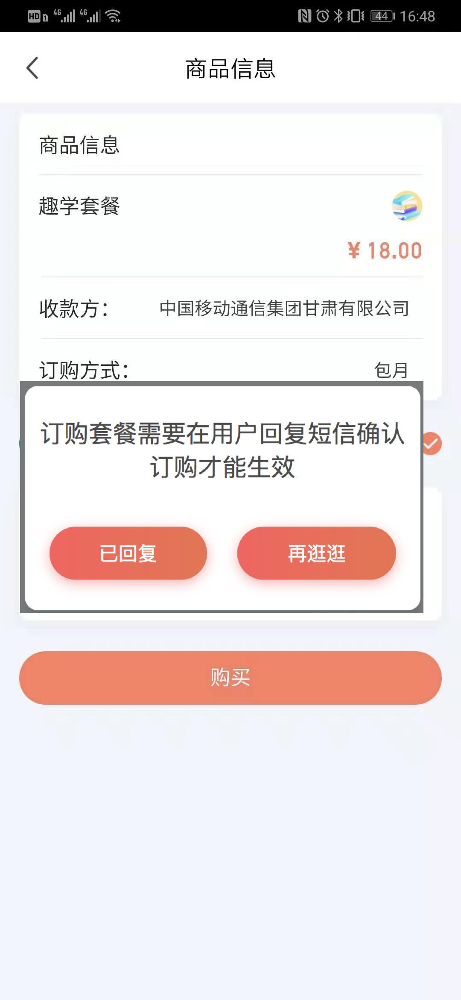|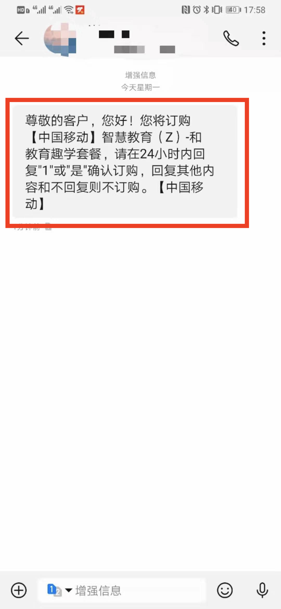
  `9.回复确认短信`|`10.订购成功短信` |`11.点击已回复` |
 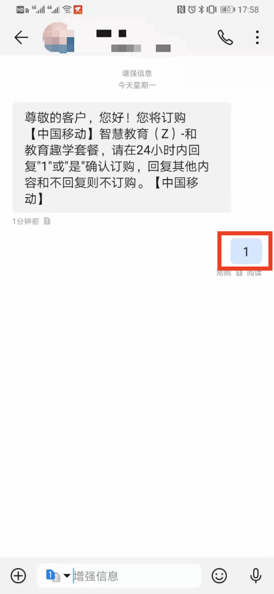|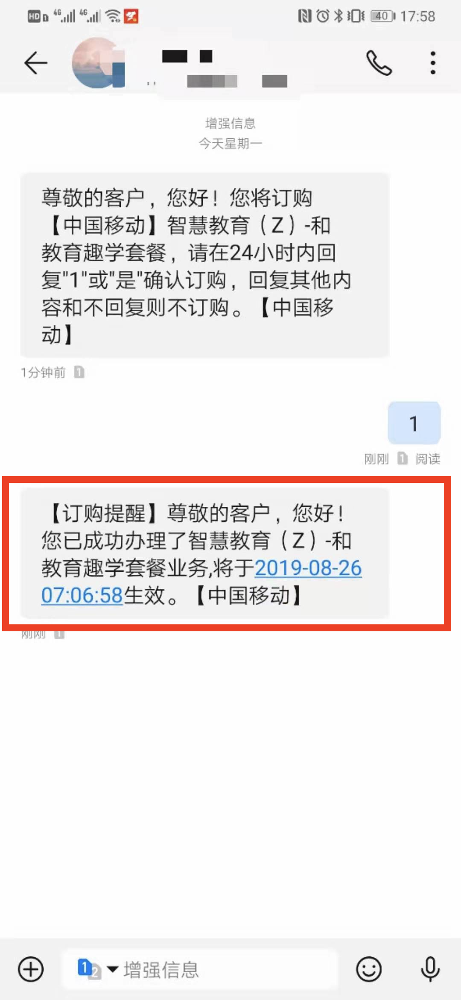|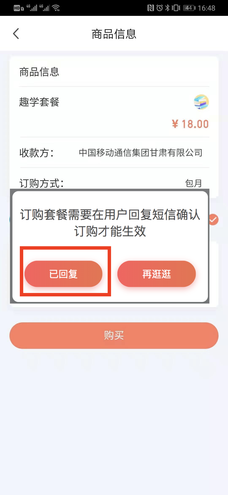
  `12.订购成功显示`| | |
  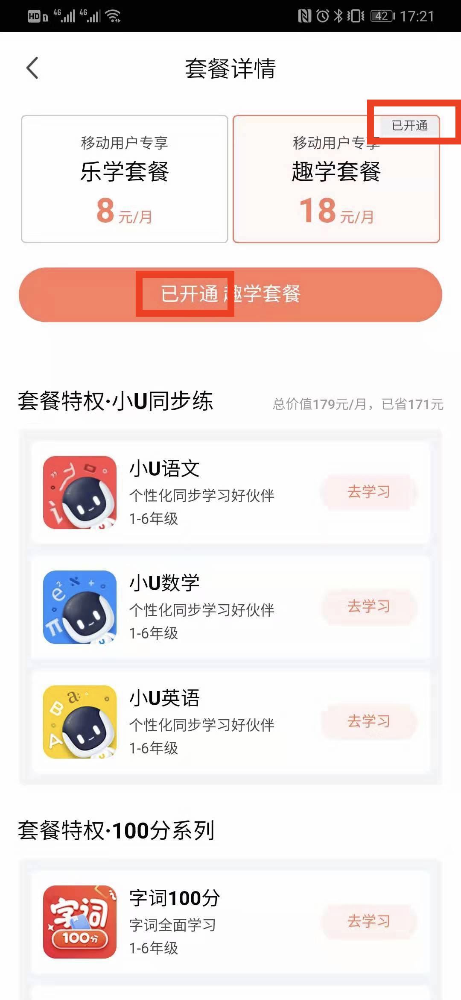||