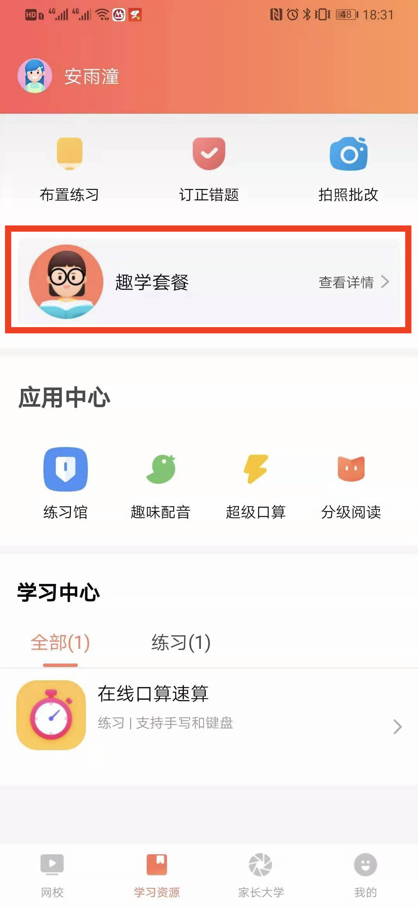
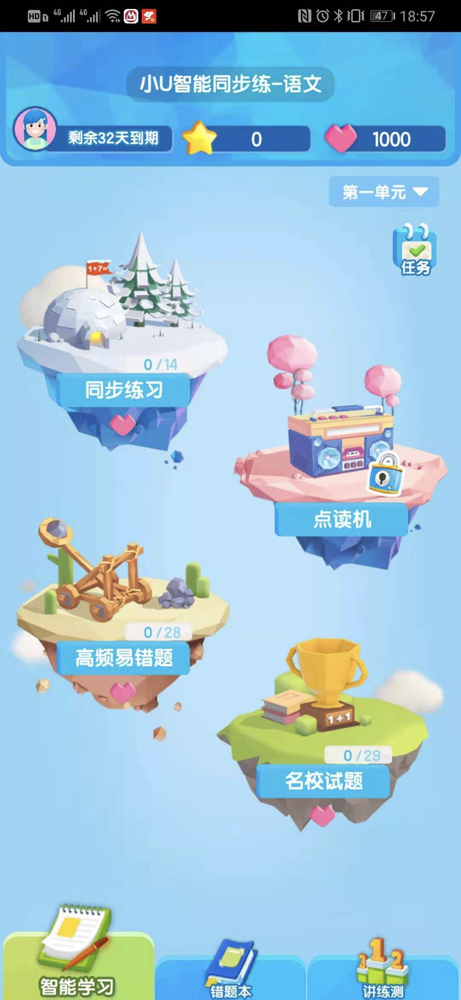

## 7.应用使用
### 7.1 套餐页应用入口
`1.点击套餐` |`2.进入套餐页`  |`3.小U系列应用入口`
-|-|-|
||
 `4.100分系列应用入口` |`2.轻课馆应用入口`  |
||
 
### 7.2 练习馆入口
`1.点击练习馆` |`2.进入练习馆`  |`3.找到智能教辅，点击已开通`
-|-|-|
||
`4.进入小U介绍页，点击立即学习` |`5.进入小U系列应用`  |`6.找到专项练习，点击已开通`
||
`7.进入100分介绍页，点击立即学习` |`8.进入100分系列应用`  |
||